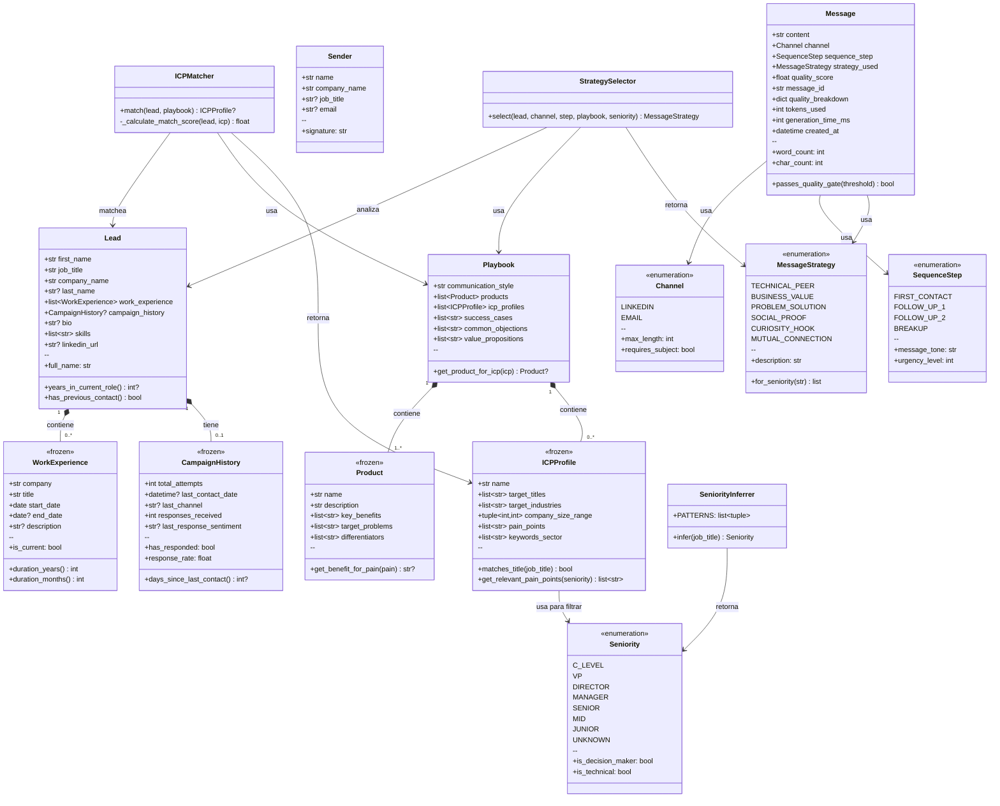
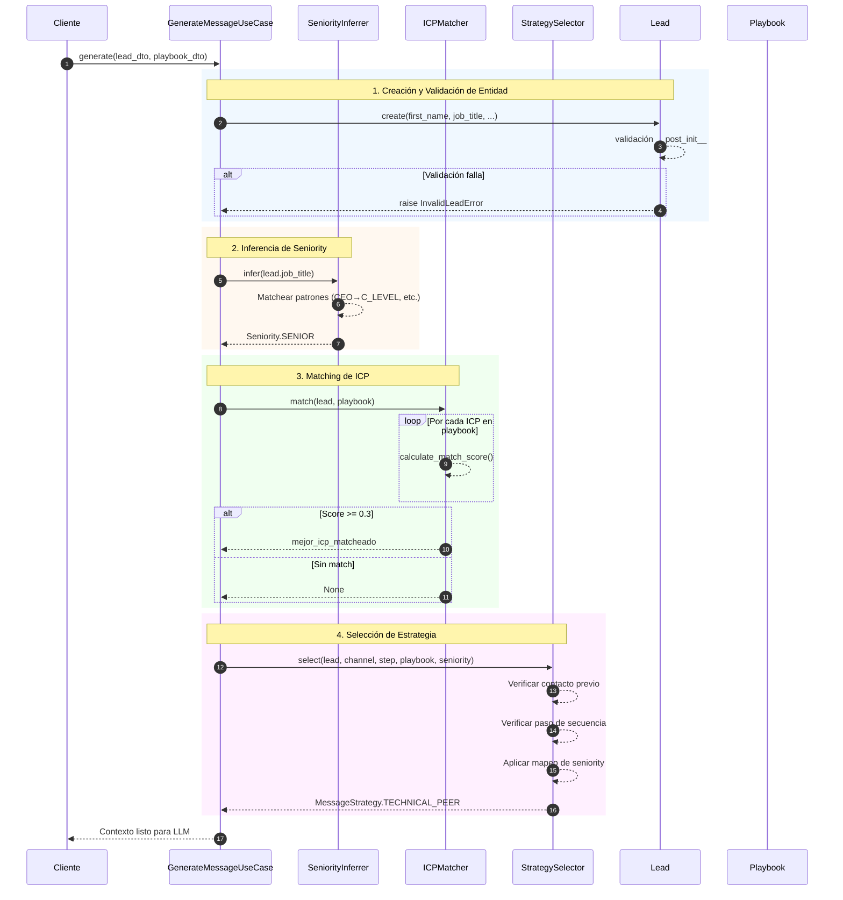
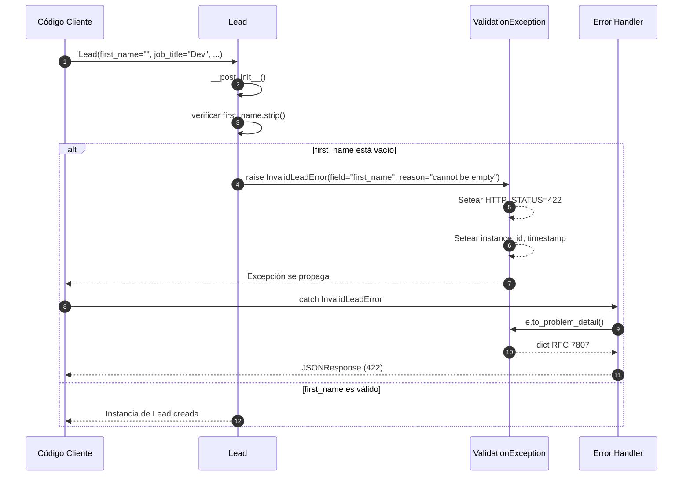
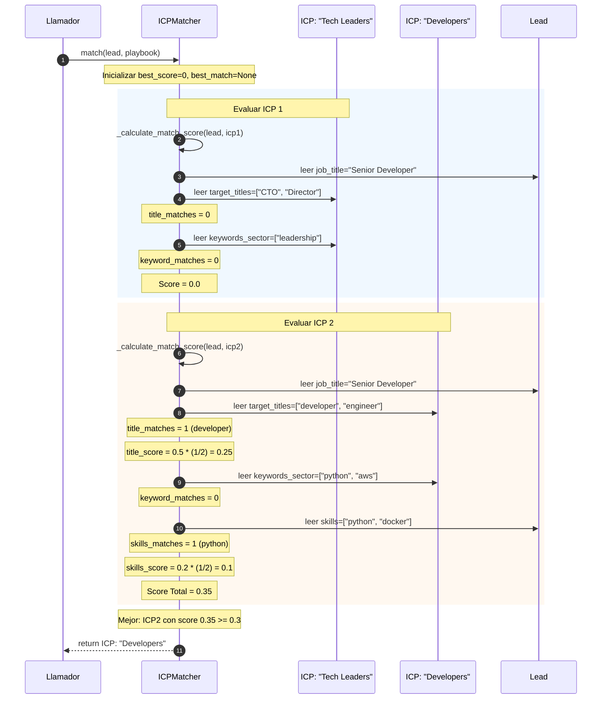

# Lead Adapter
Lead adapter va a ser una API Rest que utiliza agentes de inteligencia artificial para generar mensajes personalizados, evitando patrones de spam y adaptándose al contexto del lead, el emisor y el playbook comercial. Para el funcionamiento óptimo de la API, el sistema recibirá de su parte datos estructurados de los leads, información del remitente y el playbook.

# Feature
A partir de estos datos, la solución ejecuta una pipeline secuencial de IA que realiza las siguientes funciones:
- Análisis de contexto: Evaluación profunda de la información del cliente potencial y el perfil del emisor.
- Generación de contenido personalizado: Creación de mensajes adaptados a las necesidades específicas de cada interacción.
- Optimización de secuencias: Producción de una serie de mensajes optimizados para objetivos de ventas o marketing.

# Quick Start
## Clonar e instalar
```bash
git clone https://github.com/tu-usuario/leadadapter.git
cd leadadapter
uv sync  # o: pip install -r requirements.txt
```

## Configurar

`cp .env.example .env`

## Editar .env con tu OPENAI_API_KEY

Agregar tu api key a la variable

`OPENAI_API_KEY=YOUR_API_KEY`

## Correr

`uv run uvicorn src.main:app --reload`

# Tech Stack

| Componente | Tecnología |
|------------|------------|
| Framework | FastAPI |
| Validación | Pydantic v2 |
| LLM | OpenAI GPT-4o-mini |
| Testing | pytest |
| Linting | ruff |


# Decisiones de Diseño

## ¿Por qué Arquitectura Hexagonal?

- **Desacoplamiento**: La lógica de negocio no depende de frameworks ni detalles de infraestructura
- **Testabilidad**: El dominio se puede testear sin mocks de APIs externas
- **Flexibilidad**: Permite cambiar OpenAI por otro LLM sin tocar el dominio

## ¿Por qué DDD (Domain-Driven Design)?

- **Complejidad del problema**: Leads, ICPs, estrategias y scoring requieren un modelo rico
- **Lenguaje ubicuo**: Las entidades reflejan conceptos de negocio (Lead, Playbook, Sender)
- **Encapsulación**: Las reglas de negocio viven dentro de las entidades (`__post_init__`)

## Patrones Aplicados

| Patrón | Dónde | Justificación |
|--------|-------|---------------|
| **Value Object** | `Product`, `ICPProfile`, `WorkExperience` | Inmutabilidad, igualdad por valor |
| **Entity** | `Lead`, `Message`, `Playbook`, `Sender` | Identidad + ciclo de vida |
| **Domain Service** | `ICPMatcher`, `SeniorityInferrer`, `StrategySelector` | Lógica stateless que no pertenece a una entidad |
| **Self-Validation** | Todas las entidades (`__post_init__`) | Objetos siempre válidos (fail-fast) |
| **Strategy** | `MessageStrategy` enum | Estrategias de mensaje intercambiables |
| **Template Method** | `DomainException.to_problem_detail()` | Comportamiento base + customización |

---

# Resumen de lo Realizado

| Fase | Estado | Descripción |
|------|--------|-------------|
| 0 - Setup | Completada | Estructura hexagonal, configuración |
| 1 - Domain | Completada | Entidades, VOs, Servicios de dominio |
| 2 - Application | En progreso | Use Cases, DTOs, Ports |
| 3 - Infrastructure | Pendiente | Adapters, OpenAI, Cache |
| 4 - API | Pendiente | Endpoints, middleware |


## Fase 0 - Setup del Proyecto

**Objetivo**: Establecer la estructura base del proyecto siguiendo arquitectura hexagonal.

**Entregables**:
- Estructura de carpetas `src/` con arquitectura hexagonal
  - `domain/` - Lógica de negocio pura
  - `application/` - Casos de uso y orquestación
  - `infrastructure/` - Adaptadores externos (OpenAI, cache)
  - `api/` - Endpoints REST
- Archivos `__init__.py` para reconocimiento de paquetes Python
- `pyproject.toml` con dependencias (FastAPI, Pydantic, OpenAI, pytest, ruff)
- `requirements.txt` para ambientes sin `uv`
- `.env.example` como plantilla de variables de entorno

## Fase 1 - Capa de Dominio

**Objetivo**: Implementar la lógica de negocio central siguiendo DDD, sin dependencias externas.

**Entregables**:
- **4 Entidades**: `Lead`, `Message`, `Playbook`, `Sender`
- **4 Value Objects**: `WorkExperience`, `CampaignHistory`, `Product`, `ICPProfile`
- **4 Enums**: `Channel`, `Seniority`, `MessageStrategy`, `SequenceStep`
- **3 Servicios de Dominio**: `ICPMatcher`, `SeniorityInferrer`, `StrategySelector`
- **10 Excepciones**: Jerarquía estructurada compatible con RFC 7807
- **Validación en construcción**: Todas las entidades validan en `__post_init__`
- **100% Python puro**: Sin dependencias de frameworks

### Estructura de la Capa

```markdown
src/domain/
├── entities/           # Objetos de negocio mutables con identidad
│   ├── lead.py         # Core: La persona a contactar
│   ├── message.py      # Output: Mensaje generado
│   ├── playbook.py     # Config: Playbook de ventas
│   └── sender.py       # Contexto: Quién envía el mensaje
│
├── value_objects/      # Objetos inmutables sin identidad
│   ├── campaign_history.py   # Historial de contacto del lead
│   ├── icp_profile.py        # Perfil de Cliente Ideal
│   ├── product.py            # Producto que se vende
│   └── work_experience.py    # Historial laboral del lead
│
├── enums/              # Constantes type-safe
│   ├── channel.py          # LINKEDIN | EMAIL
│   ├── message_strategy.py # TECHNICAL_PEER | BUSINESS_VALUE | ...
│   ├── seniority.py        # C_LEVEL | VP | DIRECTOR | ...
│   └── sequence_step.py    # FIRST_CONTACT | FOLLOW_UP_1 | ...
│
├── services/           # Servicios de dominio (lógica stateless)
│   ├── icp_matcher.py       # Matchea leads con ICPs
│   ├── seniority_inferrer.py # Infiere seniority desde job title
│   └── strategy_selector.py  # Selecciona estrategia de mensaje
│
└── exceptions/         # Errores específicos del dominio
    └── domain_exceptions.py  # Jerarquía de excepciones estructuradas
```
La capa de dominio representa la **lógica de negocio central** de LeadAdapter, un sistema para generar mensajes personalizados de outreach para leads de ventas. Esta capa es:

- **Agnóstica de frameworks**: Sin dependencias de FastAPI, bases de datos o servicios externos
- **Python puro**: Usa solo biblioteca estándar + dataclasses
- **Alineada con DDD**: Sigue los principios de Domain-Driven Design

### Modelo de Dominio Completo



### Diagrama de secuencias

#### Secuencia 1: Flujo de Procesamiento de Lead 



#### Secuencia 2: Flujo de Validación de Entidad



#### Secuencia 3: Algoritmo de Matching de ICP


