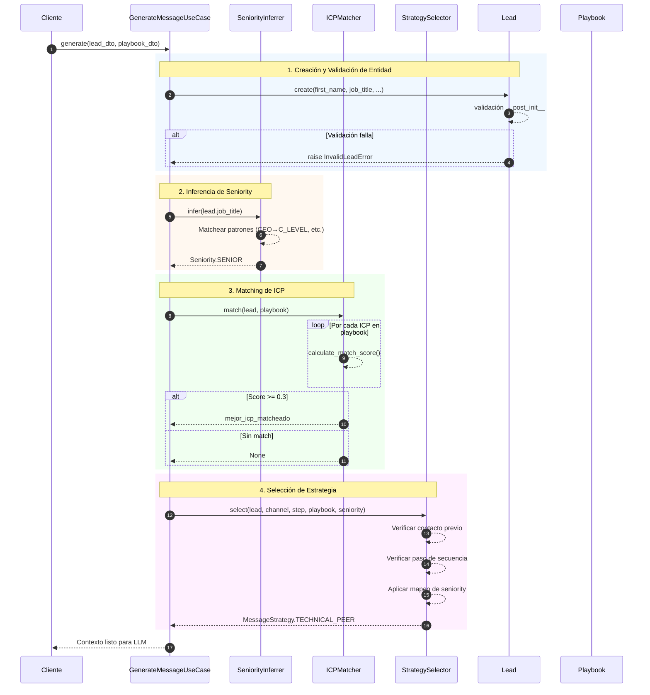
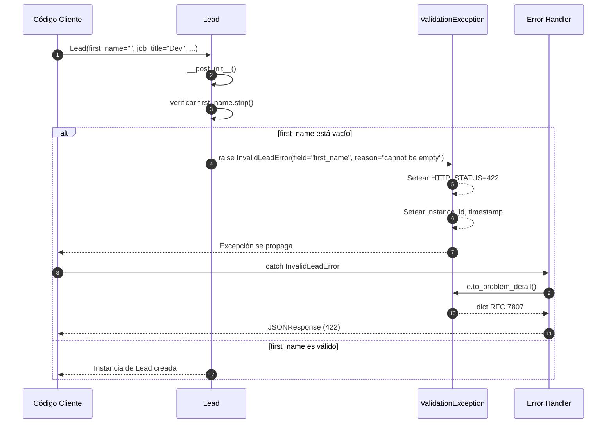
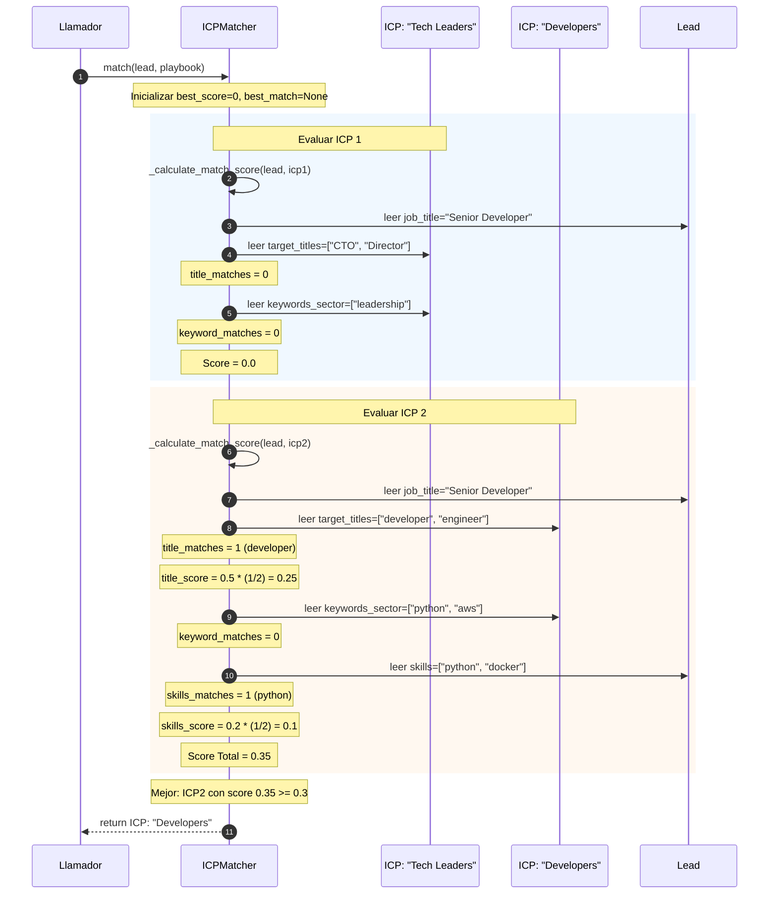
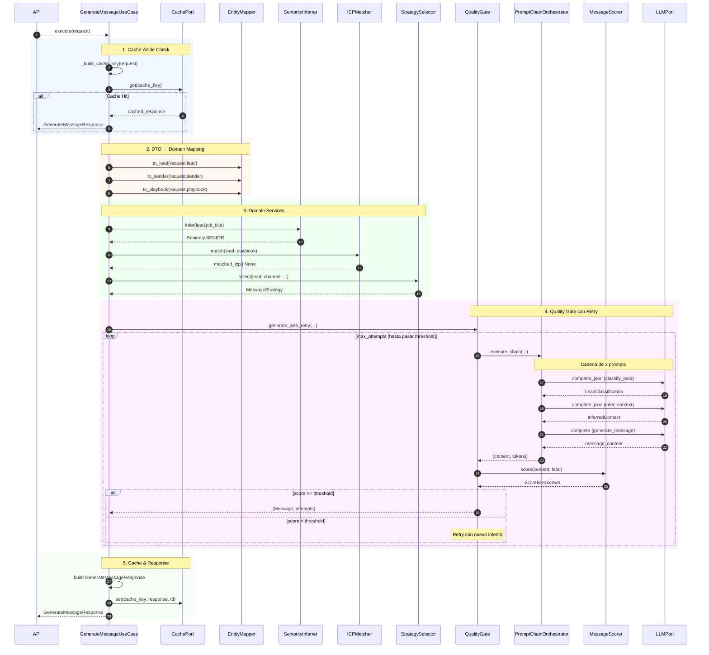
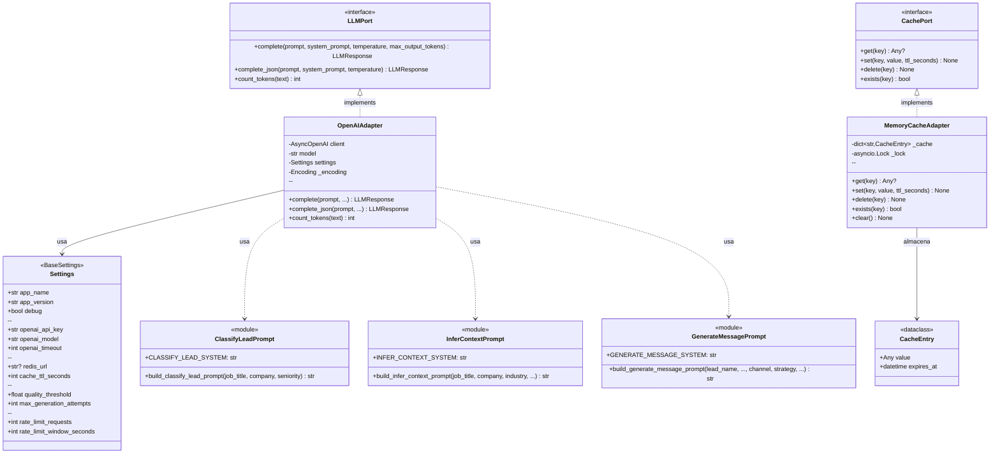
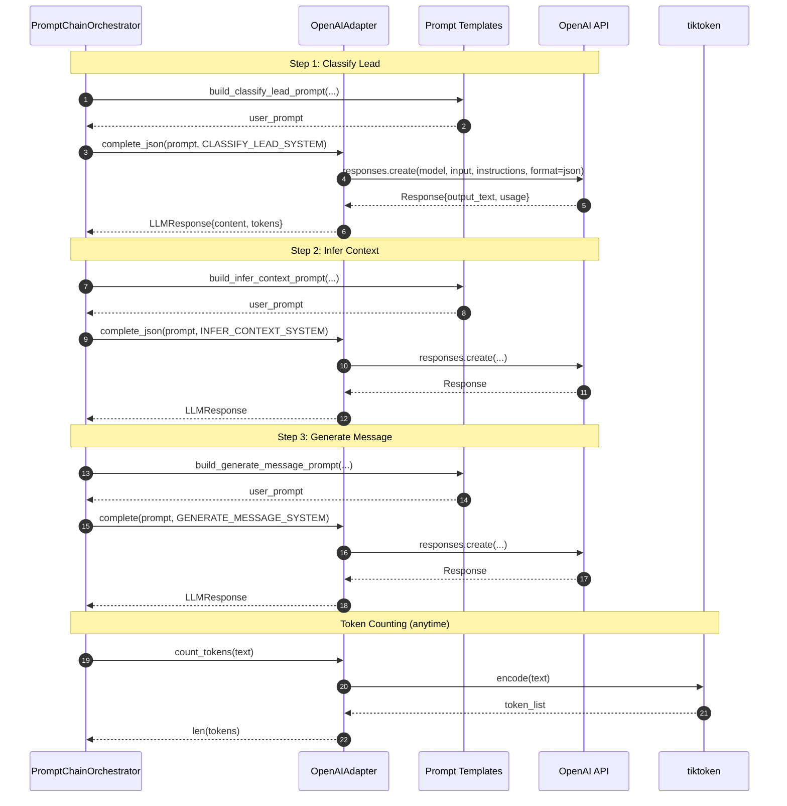

# Lead Adapter
Lead adapter va a ser una API Rest que utiliza agentes de inteligencia artificial para generar mensajes personalizados, evitando patrones de spam y adaptándose al contexto del lead, el emisor y el playbook comercial. Para el funcionamiento óptimo de la API, el sistema recibirá de su parte datos estructurados de los leads, información del remitente y el playbook.

# Feature
A partir de estos datos, la solución ejecuta una pipeline secuencial de IA que realiza las siguientes funciones:
- Análisis de contexto: Evaluación profunda de la información del cliente potencial y el perfil del emisor.
- Generación de contenido personalizado: Creación de mensajes adaptados a las necesidades específicas de cada interacción.
- Optimización de secuencias: Producción de una serie de mensajes optimizados para objetivos de ventas o marketing.

# Quick Start
## Clonar e instalar
```bash
git clone https://github.com/tu-usuario/leadadapter.git
cd leadadapter
uv sync  # o: pip install -r requirements.txt
```

## Configurar

`cp .env.example .env`

## Editar .env con tu OPENAI_API_KEY

Agregar tu api key a la variable

`OPENAI_API_KEY=YOUR_API_KEY`

## Correr

`uv run uvicorn src.main:app --reload`

# Tech Stack

| Componente | Tecnología |
|------------|------------|
| Framework | FastAPI |
| Validación | Pydantic v2 |
| LLM | OpenAI GPT-4o-mini |
| Testing | pytest |
| Linting | ruff |


# Decisiones de Diseño

## ¿Por qué Arquitectura Hexagonal?

- **Desacoplamiento**: La lógica de negocio no depende de frameworks ni detalles de infraestructura
- **Testabilidad**: El dominio se puede testear sin mocks de APIs externas
- **Flexibilidad**: Permite cambiar OpenAI por otro LLM sin tocar el dominio

## ¿Por qué DDD (Domain-Driven Design)?

- **Complejidad del problema**: Leads, ICPs, estrategias y scoring requieren un modelo rico
- **Lenguaje ubicuo**: Las entidades reflejan conceptos de negocio (Lead, Playbook, Sender)
- **Encapsulación**: Las reglas de negocio viven dentro de las entidades (`__post_init__`)

---

# Resumen de lo Realizado

| Fase | Estado | Descripción |
|------|--------|-------------|
| 0 - Setup | Completada | Estructura hexagonal, configuración |
| 1 - Domain | Completada | Entidades, VOs, Servicios de dominio |
| 2 - Application | Completada | Use Cases, DTOs, Ports, Services |
| 3 - Infrastructure | Completada | Adapters, OpenAI, Cache, Prompts |
| 4 - API | Pendiente | Endpoints, middleware |


## Fase 0 - Setup del Proyecto

**Objetivo**: Establecer la estructura base del proyecto siguiendo arquitectura hexagonal.

**Entregables**:
- Estructura de carpetas `src/` con arquitectura hexagonal
  - `domain/` - Lógica de negocio pura
  - `application/` - Casos de uso y orquestación
  - `infrastructure/` - Adaptadores externos (OpenAI, cache)
  - `api/` - Endpoints REST
- Archivos `__init__.py` para reconocimiento de paquetes Python
- `pyproject.toml` con dependencias (FastAPI, Pydantic, OpenAI, pytest, ruff)
- `requirements.txt` para ambientes sin `uv`
- `.env.example` como plantilla de variables de entorno

## Fase 1 - Capa de Dominio

**Objetivo**: Implementar la lógica de negocio central siguiendo DDD, sin dependencias externas.

**Entregables**:
- **4 Entidades**: `Lead`, `Message`, `Playbook`, `Sender`
- **4 Value Objects**: `WorkExperience`, `CampaignHistory`, `Product`, `ICPProfile`
- **4 Enums**: `Channel`, `Seniority`, `MessageStrategy`, `SequenceStep`
- **3 Servicios de Dominio**: `ICPMatcher`, `SeniorityInferrer`, `StrategySelector`
- **10 Excepciones**: Jerarquía estructurada compatible con RFC 7807
- **Validación en construcción**: Todas las entidades validan en `__post_init__`

### Estructura de la Capa

```markdown
src/domain/
├── entities/           # Objetos de negocio mutables con identidad
│   ├── lead.py         # Core: La persona a contactar
│   ├── message.py      # Output: Mensaje generado
│   ├── playbook.py     # Config: Playbook de ventas
│   └── sender.py       # Contexto: Quién envía el mensaje
│
├── value_objects/      # Objetos inmutables sin identidad
│   ├── campaign_history.py   # Historial de contacto del lead
│   ├── icp_profile.py        # Perfil de Cliente Ideal
│   ├── product.py            # Producto que se vende
│   └── work_experience.py    # Historial laboral del lead
│
├── enums/              # Constantes type-safe
│   ├── channel.py          # LINKEDIN | EMAIL
│   ├── message_strategy.py # TECHNICAL_PEER | BUSINESS_VALUE | ...
│   ├── seniority.py        # C_LEVEL | VP | DIRECTOR | ...
│   └── sequence_step.py    # FIRST_CONTACT | FOLLOW_UP_1 | ...
│
├── services/           # Servicios de dominio (lógica stateless)
│   ├── icp_matcher.py       # Matchea leads con ICPs
│   ├── seniority_inferrer.py # Infiere seniority desde job title
│   └── strategy_selector.py  # Selecciona estrategia de mensaje
│
└── exceptions/         # Errores específicos del dominio
    └── domain_exceptions.py  # Jerarquía de excepciones estructuradas
```
La capa de dominio representa la **lógica de negocio central** de LeadAdapter, un sistema para generar mensajes personalizados de outreach para leads de ventas. Esta capa es:

- **Agnóstica de frameworks**: Sin dependencias de FastAPI, bases de datos o servicios externos
- **Python puro**: Usa solo biblioteca estándar + dataclasses
- **Alineada con DDD**: Sigue los principios de Domain-Driven Design

### Modelo de Dominio Completo


### Diagrama de secuencias

#### Secuencia 1: Flujo de Procesamiento de Lead 



#### Secuencia 2: Flujo de Validación de Entidad



#### Secuencia 3: Algoritmo de Matching de ICP



## Fase 2 - Capa de Aplicación

**Objetivo**: Implementar la lógica de orquestación siguiendo Arquitectura Hexagonal con Ports & Adapters, conectando el dominio con la infraestructura a través de abstracciones.

**Entregables**:
- **2 Puertos (Interfaces)**: `LLMPort`, `CachePort`
- **6 DTOs de Request**: `LeadDTO`, `SenderDTO`, `PlaybookDTO`, `WorkExperienceDTO`, `CampaignHistoryDTO`, `ICPProfileDTO`, `ProductDTO`, `GenerateMessageRequest`
- **5 DTOs de Response**: `GenerateMessageResponse`, `QualityDTO`, `QualityBreakdownDTO`, `MetadataDTO`, `ErrorResponse`, `HealthResponse`
- **1 Use Case**: `GenerateMessageUseCase`
- **4 Application Services**: `PromptChainOrchestrator`, `MessageScorer`, `QualityGate`, `EntityMapper`
- **5 Scoring Criteria (Strategy)**: `ScoringCriterion` (ABC), `PersonalizationCriterion`, `AntiSpamCriterion`, `StructureCriterion`, `ToneCriterion`

### Estructura de la Capa

```
src/application/
├── ports/                  # Interfaces (contratos para infraestructura)
│   ├── llm_port.py         # Puerto para LLMs (complete, complete_json, count_tokens)
│   └── cache_port.py       # Puerto para cache (get, set, delete, exists, get_or_set)
│
├── dtos/                   # Data Transfer Objects (Pydantic)
│   ├── requests.py         # DTOs de entrada: Lead, Sender, Playbook, Request
│   └── responses.py        # DTOs de salida: Response, Quality, Metadata, Error
│
├── use_cases/              # Casos de uso (orquestación principal)
│   └── generate_message.py # GenerateMessageUseCase: coordina todo el flujo
│
├── services/               # Servicios de aplicación
│   ├── prompt_chain_orchestrator.py  # Cadena de 3 prompts LLM
│   ├── quality_gate.py               # Control de calidad con reintentos
│   ├── message_scorer.py             # Scorer extensible (Strategy Pattern)
│   └── scoring/                      # Criterios de scoring pluggables
│       ├── scoring_criterion.py      # ABC para criterios
│       ├── personalization_criterion.py
│       ├── anti_spam_criterion.py
│       ├── structure_criterion.py
│       └── tone_criterion.py
│
└── mappers/                # Conversión DTO ↔ Entidad
    └── entity_mapper.py    # Data Mapper Pattern
```

La capa de aplicación representa la **orquestación y coordinación** entre el dominio y la infraestructura. Esta capa:

- **Depende solo de abstracciones**: Los puertos son interfaces ABC que la infraestructura implementa
- **Usa Pydantic para validación**: DTOs validan datos de entrada/salida automáticamente
- **Implementa Cache-Aside**: Verifica cache antes de procesar, guarda resultados exitosos
- **Extensible via Strategy**: Nuevos criterios de scoring sin modificar código existente

### Modelo de la Capa de Aplicación

```mermaid
classDiagram
    direction TB
    
    %% ===== PUERTOS (INTERFACES) =====
    class LLMPort {
        <<interface>>
        +complete(prompt, system_prompt, temperature, max_output_tokens) LLMResponse
        +complete_json(prompt, system_prompt, temperature) LLMResponse
        +count_tokens(text) int
    }
    
    class LLMResponse {
        <<frozen>>
        +str content
        +int prompt_tokens
        +int response_tokens
        +str model
        --
        +total_tokens: int
    }
    
    class CachePort {
        <<interface>>
        +get(key) Any?
        +set(key, value, ttl_seconds) None
        +delete(key) None
        +exists(key) bool
        +get_or_set(key, factory, ttl_seconds) Any
    }
    
    %% ===== DTOs REQUEST =====
    class GenerateMessageRequest {
        +str channel
        +str sequence_step
        +LeadDTO lead
        +SenderDTO sender
        +PlaybookDTO playbook
    }
    
    class LeadDTO {
        +str first_name
        +str? last_name
        +str job_title
        +str company_name
        +list~WorkExperienceDTO~ work_experience
        +CampaignHistoryDTO? campaign_history
        +str? bio
        +list~str~ skills
        +str? linkedin_url
    }
    
    class PlaybookDTO {
        +str communication_style
        +list~ProductDTO~ products
        +list~ICPProfileDTO~ icp_profiles
        +list~str~ success_cases
        +list~str~ value_propositions
    }
    
    %% ===== DTOs RESPONSE =====
    class GenerateMessageResponse {
        +str message_id
        +str content
        +QualityDTO quality
        +str strategy_used
        +MetadataDTO metadata
        +datetime created_at
    }
    
    class QualityDTO {
        +float score
        +QualityBreakdownDTO breakdown
        +bool passes_threshold
    }
    
    class MetadataDTO {
        +int tokens_used
        +int generation_time_ms
        +str model_used
        +int attempts
    }
    
    %% ===== USE CASE =====
    class GenerateMessageUseCase {
        +LLMPort llm
        +CachePort cache
        +PromptChainOrchestrator prompt_orchestrator
        +QualityGate quality_gate
        +StrategySelector strategy_selector
        +SeniorityInferrer seniority_inferrer
        +ICPMatcher icp_matcher
        +EntityMapper entity_mapper
        --
        +execute(request) GenerateMessageResponse
        -_build_cache_key(request) str
    }
    
    %% ===== APPLICATION SERVICES =====
    class PromptChainOrchestrator {
        +LLMPort llm
        --
        +execute_chain(lead, sender, ...) tuple~str,int~
        -_classify_lead(lead) tuple~LeadClassification,int~
        -_infer_context(lead, ...) tuple~InferredContext,int~
        -_generate_message(lead, ...) tuple~str,int~
    }
    
    class LeadClassification {
        +str role_type
        +float confidence
    }
    
    class InferredContext {
        +list~str~ pain_points
        +list~str~ hooks
        +list~str~ talking_points
    }
    
    class QualityGate {
        +PromptChainOrchestrator orchestrator
        +MessageScorer scorer
        +float threshold
        +int max_attempts
        --
        +generate_with_retry(lead, ...) tuple~Message,int~
    }
    
    class MessageScorer {
        -list~ScoringCriterion~ _criteria
        +STANDARD_CRITERIA: frozenset
        --
        +score(content, lead) ScoreBreakdown
        +get_criterion(name) ScoringCriterion?
        +max_possible_score: float
        +criteria: list
    }
    
    class ScoreBreakdown {
        +float personalization
        +float anti_spam
        +float structure
        +float tone
        +dict extra_scores
        --
        +total: float
        +get_score(name) float
        +to_dict() dict
    }
    
    %% ===== SCORING CRITERIA (STRATEGY) =====
    class ScoringCriterion {
        <<abstract>>
        +name: str
        +max_score: float
        --
        +score(content, lead) float
    }
    
    class PersonalizationCriterion {
        +name = "personalization"
        +max_score = 3.0
    }
    
    class AntiSpamCriterion {
        +name = "anti_spam"
        +max_score = 3.0
    }
    
    class StructureCriterion {
        +name = "structure"
        +max_score = 2.0
    }
    
    class ToneCriterion {
        +name = "tone"
        +max_score = 2.0
    }
    
    %% ===== MAPPER =====
    class EntityMapper {
        +to_lead(dto) Lead
        +to_sender(dto) Sender
        +to_playbook(dto) Playbook
    }
    
    %% ===== RELACIONES =====
    LLMPort ..> LLMResponse : returns
    
    GenerateMessageUseCase --> LLMPort : usa
    GenerateMessageUseCase --> CachePort : usa
    GenerateMessageUseCase --> PromptChainOrchestrator
    GenerateMessageUseCase --> QualityGate
    GenerateMessageUseCase --> EntityMapper
    GenerateMessageUseCase ..> GenerateMessageRequest : input
    GenerateMessageUseCase ..> GenerateMessageResponse : output
    
    PromptChainOrchestrator --> LLMPort : usa
    PromptChainOrchestrator ..> LeadClassification
    PromptChainOrchestrator ..> InferredContext
    
    QualityGate --> PromptChainOrchestrator
    QualityGate --> MessageScorer
    
    MessageScorer --> ScoringCriterion : strategy
    MessageScorer ..> ScoreBreakdown : returns
    
    ScoringCriterion <|-- PersonalizationCriterion
    ScoringCriterion <|-- AntiSpamCriterion
    ScoringCriterion <|-- StructureCriterion
    ScoringCriterion <|-- ToneCriterion
    
    GenerateMessageResponse --> QualityDTO
    GenerateMessageResponse --> MetadataDTO
    QualityDTO --> QualityBreakdownDTO
    
    GenerateMessageRequest --> LeadDTO
    GenerateMessageRequest --> PlaybookDTO
    
    EntityMapper ..> LeadDTO : maps from
    EntityMapper ..> Lead : maps to
```



### Diagrama de Secuencia: Flujo Completo del Use Case



## Fase 3 - Capa de Infraestructura

**Objetivo**: Implementar los adaptadores concretos que satisfacen los puertos definidos en Application Layer, conectando con servicios externos (OpenAI, Redis/Memory).

**Entregables**:
- **2 Adapters**: `OpenAIAdapter` (LLMPort), `MemoryCacheAdapter` (CachePort)
- **1 Configuración**: `Settings` (pydantic-settings con 12 variables)
- **3 Templates de Prompts**: `classify_lead`, `infer_context`, `generate_message`
- **Patrones Aplicados**: Adapter, Singleton (cached settings)

### Estructura de la Capa

```
src/infrastructure/
├── config/                 # Configuración de la aplicación
│   └── settings.py         # Settings con pydantic-settings (Singleton via lru_cache)
│
├── adapters/               # Implementaciones concretas de los puertos
│   ├── openai_adapter.py   # Implementa LLMPort → OpenAI API
│   └── memory_cache_adapter.py  # Implementa CachePort → Dict in-memory
│
└── prompts/                # Templates de prompts para LLM
    ├── classify_lead.py    # Prompt para clasificar rol del lead
    ├── infer_context.py    # Prompt para inferir pain points y hooks
    └── generate_message.py # Prompt para generar mensaje final
```

La capa de infraestructura representa los **detalles técnicos y conexiones externas**. Esta capa:

- **Implementa los puertos**: Los adapters son clases concretas que satisfacen las interfaces ABC
- **Es intercambiable**: Se puede cambiar OpenAI por Anthropic, o Memory por Redis, sin tocar Application
- **Centraliza configuración**: Settings usa pydantic-settings con variables de entorno
- **Encapsula prompts**: Los templates de prompts viven en infraestructura, no en dominio

### Modelo de la Capa de Infraestructura



### Tabla de Configuración (Settings)

| Variable | Tipo | Default | Descripción |
|----------|------|---------|-------------|
| `app_name` | `str` | `"LeadAdapter"` | Nombre de la aplicación |
| `app_version` | `str` | `"1.0.0"` | Versión de la API |
| `debug` | `bool` | `False` | Modo debug |
| `openai_api_key` | `str` | **Required** | API Key de OpenAI |
| `openai_model` | `str` | `"gpt-5.1"` | Modelo a usar |
| `openai_timeout` | `int` | `30` | Timeout en segundos |
| `redis_url` | `str?` | `None` | URL de Redis (opcional) |
| `cache_ttl_seconds` | `int` | `3600` | TTL del cache (1 hora) |
| `quality_threshold` | `float` | `6.0` | Umbral de calidad (0-10) |
| `max_generation_attempts` | `int` | `3` | Intentos máximos |
| `rate_limit_requests` | `int` | `100` | Requests por ventana |
| `rate_limit_window_seconds` | `int` | `60` | Ventana de rate limit |

### Estructura de Prompts

| Prompt | System Prompt | User Prompt Builder | Output |
|--------|---------------|---------------------|--------|
| **classify_lead** | Clasificador B2B con 4 role types | `build_classify_lead_prompt(job_title, company, seniority)` | JSON: `{role_type, confidence, reasoning}` |
| **infer_context** | Experto en research B2B | `build_infer_context_prompt(job_title, company, industry, role_type, ...)` | JSON: `{pain_points[], hooks[], talking_points[]}` |
| **generate_message** | Copywriter B2B experto | `build_generate_message_prompt(lead_name, channel, strategy, pain_points, ...)` | String: mensaje final |

### Diagrama de Secuencia: Adapter Flow



